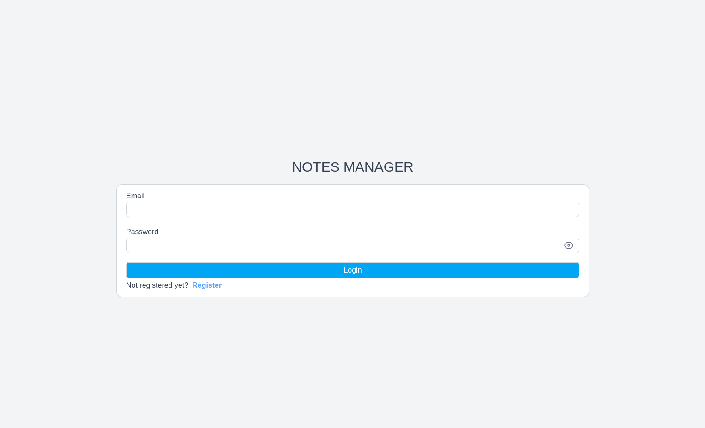
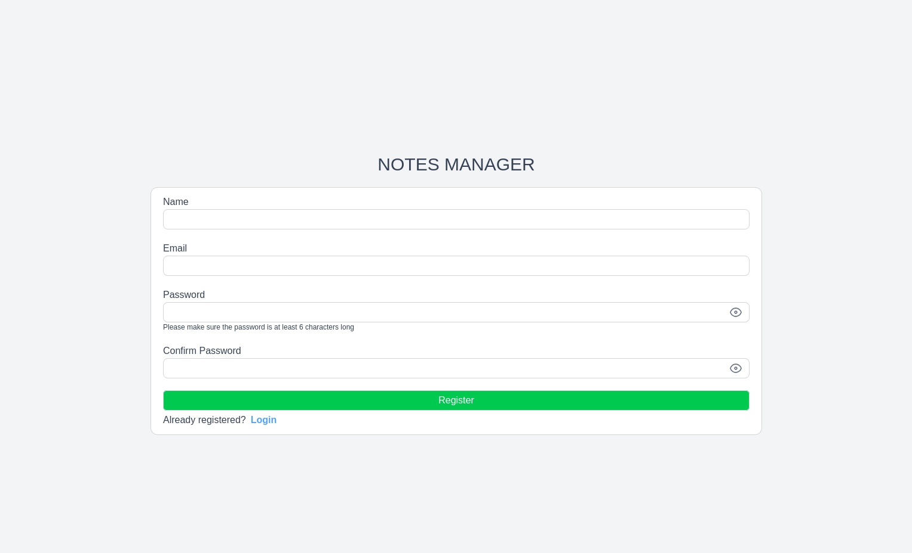
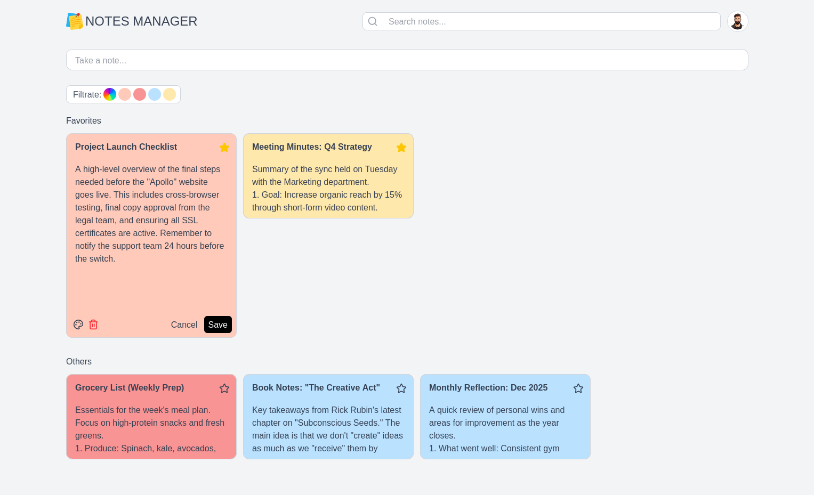
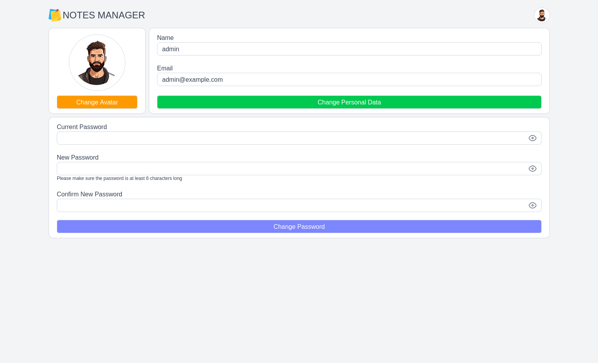

# Notes Manager

## Overview

The Notes Manager is a simple and intuitive app for managing notes. It's built using [Next.js](https://nextjs.org/) for the frontend app and [Laravel](https://laravel.com/) + [MySQL](https://www.mysql.com/) for the backend REST API.

## Installation

You need to have [Docker](https://www.docker.com/) installed on your system.

Clone the [APP](https://github.com/iuryveloso/notes-manager-app) and [API](https://github.com/iuryveloso/notes-manager-api) repositories. It's best to place them in the same directory.

Create a copy of the o `.env.example` file in the root directory of the app. Rename it to a `.env` and fill in the remaining information.

Create a copy of the o `.env.example` file in the root directory of the API. Rename it to a `.env` and fill in the remaining information.

Create a copy of the o `.env.example` file in the a `./docker` folder inside the API directory. Rename it to a `.env` and fill in the remaining information, paying close attention to the app and API directories (APP_DIRECTORY and API_DIRECTORY).

Access the `./docker` folder inside the API directory via the terminal and run the commands s `docker compose build api` and `docker compose build web_app`. Then, run the command `docker compose up -d`.

After the Docker containers are up, run de `docker exec -it notes_manager_api  bash` and execute the following commands:

1. `composer install`
2. `php artisan migrate`
3. `php artisan key:generate`
4. `php artisan optimize`
5. `php artisan storage:link`

Finally, open your browser and go to http://localhost:3000. Enjoy!
